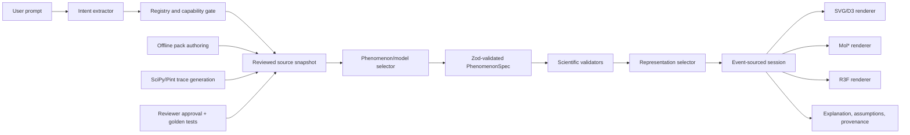

## 1. Product definition

Spatial RAVIA is a curated prompt-to-representation compiler for undergraduate STEM learners. A prompt selects a reviewed phenomenon pack, an appropriate representation, supported parameters, explanatory text, and claim-level sources. The MVP supports DNA replication, neuronal action potential, and two-body orbital motion.

It is not a general scientific oracle, molecular-dynamics engine, arbitrary equation solver, or research-grade predictor. Unknown phenomena and unsupported interventions produce an explicit refusal without changing the current scene.

A **visualization** displays measured or deposited data. An **explanatory model** presents curated causal states using schematic geometry or normalized time. A **simulation** numerically solves published equations using declared units, initial conditions, algorithms, and benchmark tests. The DNA MVP is an explanatory model with an optional literal B-DNA reference, not a simulation.

## 2. Decisions made

| Decision | Concrete answer | Basis |
|---|---|---|
| First user | First-year undergraduate STEM learner asking “how does this work?” | Product |
| Primary workflow | Prompt → reviewed phenomenon → interactive view → inspect components/stages → ask bounded follow-up → inspect assumptions/sources | Product |
| First demonstrations | DNA replication; Hodgkin–Huxley action potential; two-body orbit validated against JPL data | Research: [Hodgkin–Huxley](https://physoc.onlinelibrary.wiley.com/doi/10.1113/jphysiol.1952.sp004764), [JPL Horizons](https://ssd.jpl.nasa.gov/horizons/manual.html) |
| Scientific validity | Every visible claim has a source; parameters have units and bounds; every view declares literal/data-derived/equation-derived/schematic; a named reviewer approves each public pack | Product |
| Generation authority | The LLM may select registered IDs and parameters. It may not invent mechanisms, equations, sources, entities, or geometry | Reliability |
| Sources | Curated local snapshots from primary literature and authoritative databases; live retrieval is never inserted directly into a model | [BioModels reproducibility findings](https://www.ebi.ac.uk/biomodels/reproducibility), [RCSB APIs](https://www.rcsb.org/docs/programmatic-access/web-apis-overview) |
| Repository disposition | Retain compiler, session reducer, scene compiler, primitives, process packs, Mol*, and tests. Reconnect them to the route. Retire the B-DNA-only prompt parser, production fixture claims, and global process-specific rejection regexes | Repo: [model.ts](/Users/zerozae/Desktop/ravia-research/ravia-lab/app/code/spatial-ravia/model.ts:257), [prototype.tsx](/Users/zerozae/Desktop/ravia-research/ravia-lab/app/code/spatial-ravia/prototype.tsx:1) |
| Evaluation status | Historical audit: 78/108. Current `HEAD` `5b11daa`: 108/108 after adding exact aliases, typo mappings, and rejection regexes. This is a repaired fixed suite, not unseen validation | Repo: [evaluation report](/Users/zerozae/Desktop/ravia-research/ravia-lab/SPATIAL_RAVIA_EVALUATION_REPORT.json) |
| Historical 30 failures | 7 paraphrases, 4 misspellings, 3 contexts, 1 ambiguity, 2 misconceptions, 4 impossible interventions, 4 conflicts, 1 misleading 3D, 1 alias collision, 2 adversarial prompts, 1 follow-up | Repo history |
| Application stack | React 19 + Next 16 static export; SVG+D3 for processes/graphs; Mol* for deposited molecular structures; React Three Fiber only for spatial/orbital scenes | [Next static export](https://nextjs.org/docs/app/guides/static-exports), [D3 scales](https://d3js.org/d3-scale), [Mol*](https://pubmed.ncbi.nlm.nih.gov/33956157/), [R3F](https://r3f.docs.pmnd.rs/getting-started/introduction) |
| Validation/orchestration | Zod 4 as runtime schema and JSON-schema source; existing event reducer plus `requestAnimationFrame`; no LangChain or XState | [Zod JSON Schema](https://zod.dev/json-schema) |
| Computation | No general browser solver. Generate validated quantitative traces offline with Python, SciPy, and unit checking; publish inputs, solver configuration, and expected outputs | [SciPy ODE solvers](https://docs.scipy.org/doc/scipy/reference/integrate.html) |
| Persistence/deployment | Versioned `localStorage`; no accounts or database. Release the curated slice as a GitHub Pages static export. Move to server hosting only when the LLM adapter is enabled | Repo + [Next export constraints](https://nextjs.org/docs/app/guides/static-exports) |
| Testing | Retain `node:test` for model contracts; add Playwright for the visible workflow; create a sealed prompt holdout set that developers cannot tune against | Repo |

## 3. Target architecture



| Stage | Execution and contract | Failure, validation, cache |
|---|---|---|
| Intent extraction | Deterministic client matcher for MVP; later server-side structured LLM output | Unknown IDs or low confidence → clarification; cache normalized prompt + registry version |
| Classification | Deterministic ontology and capability rules | Multiple phenomena or contradictory context → clarification |
| Retrieval | Offline allowlisted source adapters; RCSB server/offline adapter | Missing license, source, or version → reject; cache provider ID + record version |
| Model selection | Deterministically select an approved pack/model variant | No approved variant → unsupported |
| Specification | LLM may fill only registered IDs; Zod parses the complete object | Unknown fields, entities, units, or interactions → reject |
| Scientific validation | Referential integrity, dimensions, bounds, invariants, provenance, representation honesty | Any error blocks rendering |
| Representation selection | Deterministic evidence gate, then task rules | Molecular 3D requires coordinates; quantitative graph requires validated data; otherwise schematic |
| Rendering/session | Client-only event reducer; renderers consume the same session clock and selection state | Renderer failure falls back to explanation and provenance without discarding state |

## 4. Schema

```ts
type RepresentationKind =
  | "molecular-structure" | "mechanistic-process" | "spatial-scene"
  | "dynamic-field" | "graph" | "timeline" | "state-space"
  | "equation-model" | "mixed";

type EvidenceMode =
  | "literal" | "data-derived" | "equation-derived"
  | "schematic" | "metaphorical";

type ModelClass = "visualization" | "explanatory-model" | "simulation";

interface Quantity {
  value: number;
  unit: string;
  bounds?: [number, number];
  claimId: string;
}

interface Claim {
  id: string;
  text: string;
  status: "verified" | "uncertain" | "disputed";
  support: "direct" | "inferred" | "assumption";
  sourceIds: string[];
}

interface Source {
  id: string;
  title: string;
  doiOrUrl: string;
  type: "primary-paper" | "database" | "review" | "documentation";
  version?: string;
  accessedAt: string;
  license?: string;
}

interface Component {
  id: string;
  label: string;
  kind: string;
  ontologyIds: string[];
  evidenceMode: EvidenceMode;
  claimIds: string[];
  geometry: { primitive: string; props: Record<string, unknown> };
}

interface ViewSpec {
  id: string;
  kind: RepresentationKind;
  renderer: "svg" | "d3" | "molstar" | "r3f";
  evidenceMode: EvidenceMode;
  componentIds: string[];
  synchronizedBy?: "time" | "selection" | "parameter";
}

interface PhenomenonSpec {
  schemaVersion: "1";
  id: string;
  version: string;
  title: string;
  domain: string;
  context: Record<string, string>;
  modelClass: ModelClass;
  components: Component[];
  relations: Array<{ from: string; to: string; type: string; claimIds: string[] }>;
  states: Array<{ id: string; order: number; active: string[]; claimIds: string[] }>;
  transitions: Array<{ from: string; to: string; trigger: string; claimIds: string[] }>;
  parameters: Array<{ id: string; value: Quantity; editable: boolean }>;
  timeline: {
    basis: "normalized" | "physical";
    duration: Quantity;
    keyframes: Array<{ at: number; stateId: string }>;
  };
  views: ViewSpec[];
  interactions: Array<{
    id: string;
    type: "select" | "hide" | "isolate" | "set-parameter" | "change-view";
    targetIds: string[];
    allowedValues?: unknown[];
  }>;
  claims: Claim[];
  sources: Source[];
  assumptions: Claim[];
  uncertainties: Claim[];
  limitations: Claim[];
  supportedFollowUps: string[];
}
```

## 5. First vertical slice

Submitting “Show bacterial DNA replication” opens a full-height replication-fork workspace compiled from [dna-process.ts](/Users/zerozae/Desktop/ravia-research/ravia-lab/app/code/spatial-ravia/dna-process.ts:45).

- The main SVG shows parental strands, helicase, SSB, primase, primers, polymerase, continuous leading synthesis, discontinuous lagging synthesis, primer removal, Okazaki fragments, and ligase. Discontinuous synthesis is grounded in the [original Okazaki experiments](https://pubmed.ncbi.nlm.nih.gov/4967086/) and later [single-molecule replisome observations](https://pmc.ncbi.nlm.nih.gov/articles/PMC2651468/).
- Play, pause, restart, scrub, and `0.25×/0.5×/1×/2×` controls share one normalized stage clock.
- Clicking a component selects it; a component menu hides or isolates it. Labels and 5′/3′ direction markers can be toggled.
- The stage panel coordinates: closed duplex → fork opening → priming → extension → primer replacement/ligation.
- “Fork mechanism” is marked **schematic explanatory model**. “DNA structure” opens the existing Mol* view marked **literal deposited coordinates for B-DNA only**. PDB 1ZF5 is a 10-residue B-DNA crystal structure, not a replication fork ([RCSB 1ZF5](https://www.rcsb.org/structure/1ZF5)).
- Sources, assumptions, scale distortions, and uncertainty remain available at every stage.
- Unsupported follow-ups return a reason plus supported actions and preserve the current model and playback state.
- Action potential later tests synchronized schematic + voltage trace. Orbital mechanics tests reusable 3D, equation-derived state, physical time/units, and validation against JPL Horizons.

## 6. Execution plan

| # | Objective and work | Completion check | Do not attempt yet |
|---|---|---|---|
| 1 | Extract the current B-DNA UI into `DnaMolecularView.tsx`; preserve Mol* behavior and lazy loading | Existing B-DNA controls still work | New molecular generation |
| 2 | Rebuild `prototype.tsx` as the process workspace using `process-registry.ts`, `model.ts`, and `scene-compiler.ts`; use commit `3fd4f02` only as a UI reference | “Show DNA replication” renders the compiled fork | Schema redesign |
| 3 | Complete DNA controls, component selection/hide/isolate, stage panel, labels, scrub, and speed | Reducer tests plus Playwright happy path | LLM |
| 4 | Add scale switch to `DnaMolecularView`; expose fidelity, assumptions, limitations, and claim-level links | No molecular view appears without an approved structure mapping | Dynamic retrieval |
| 5 | Define Zod `PhenomenonSpec` schemas and validate DNA at module load/test time | Mutated references, bounds, units, and source links fail | Orbit/general renaming |
| 6 | Replace global contradiction regexes with pack-owned capabilities and typed incompatibility rules | Current 108 cases pass plus 100 sealed holdout prompts ≥90%, with 100% unsafe-case abstention | Prompt fine-tuning on holdout |
| 7 | Make representation selection consume evidence availability and the new schema | Molecular/quantitative requests cannot bypass evidence gates | More renderers |
| 8 | Connect the action-potential pack to SVG+D3 using a reviewed Hodgkin–Huxley trace | Shared controls and state work without DNA-specific code | Arbitrary electrophysiology |
| 9 | Generalize `BiologicalProcessPack` to `PhenomenonPack`; add equation-model and spatial component kinds | Existing DNA/action packs migrate with no behavior regression | LLM-authored packs |
| 10 | Add two-body orbit pack, offline SciPy generation, JPL benchmark fixture, and R3F renderer | Position error meets declared tolerance at benchmark epochs | N-body mission simulation |
| 11 | Add one server-side structured-output LLM adapter that emits only registered intent IDs | Invalid or unavailable provider always falls back or abstains | General web agent |
| 12 | Add CI for typecheck, tests, evaluation threshold, Playwright, static build, and GitHub Pages deployment | A clean checkout deploys only when every gate passes | Accounts/database |

## 7. Validation gates

- `npm run typecheck`, lint, build, model tests, and Playwright all pass. Current study reran typecheck and 112/112 Spatial RAVIA tests successfully.
- DNA pack has zero schema, reference, provenance, unit, or invariant errors.
- Every displayed claim resolves to at least one accessible source; every public pack has recorded reviewer approval.
- Every view displays its evidence mode; no uncurated molecular scene is labeled literal.
- All 108 fixed evaluation cases pass, sealed holdout accuracy is at least 90%, and every unsafe/adversarial case abstains.
- Play/pause/scrub/speed remain synchronized within one frame; follow-ups preserve the active model object.
- Unsupported prompts and renderer failures preserve the last valid scene.
- Chromium, Firefox, and WebKit pass at desktop and mobile widths with no overlap or console errors.
- Mol* is lazy-loaded; the initial DNA process view does not download the Mol* bundle.
- No API key reaches client code; external records, URLs, and LLM output are allowlisted and schema-validated.

## 8. Deferred scope

No arbitrary phenomenon generation, molecular dynamics, protein folding, reaction prediction, drug dosing, clinical guidance, user-authored equations, generative 3D geometry, general web retrieval, autonomous source selection, N-body mission design, accounts, collaboration, database, mobile-native app, VR, or user-authored phenomenon packs.

## 9. First Codex task

```text
Implement only the first visible Spatial RAVIA DNA-replication slice.

Read PROJECT_AUDIT.md and the current Spatial RAVIA modules first. Preserve all user changes.

1. Extract the current B-DNA/Mol* experience from app/code/spatial-ravia/prototype.tsx into DnaMolecularView.tsx without changing its behavior.
2. Rebuild prototype.tsx as a compact process workspace wired to process-registry.ts, model.ts, and scene-compiler.ts. Use commit 3fd4f02 as reference only; do not restore it wholesale.
3. Support “Show DNA replication” and the existing DNA aliases through startSessionFromPrompt.
4. Render compileSceneFromSession as the primary SVG view.
5. Add play/pause, restart, scrub, speed, labels, directionality, selection, hide, and isolate controls through existing session events.
6. Add a two-option scale control:
   - Fork mechanism: “schematic explanatory model; normalized time”
   - DNA structure: existing DnaMolecularView with “literal PDB 1ZF5 coordinates; not a replication-fork structure”
7. Display the active stage, selected component explanation, assumptions, limitations, and source links.
8. Unsupported prompts must show the resolver reason and preserve the last valid session.
9. Do not add an LLM, retrieval, persistence, new process pack, equation solver, or schema migration.
10. Add focused model/UI tests, run typecheck, lint, Spatial RAVIA tests, build, and verify the route in Chromium at desktop and mobile widths.

Completion requires a visibly functional DNA replication workspace at /code/spatial-ravia/ with the generic process engine driving the scene and the existing Mol* viewer available only as the secondary molecular-scale view.
```