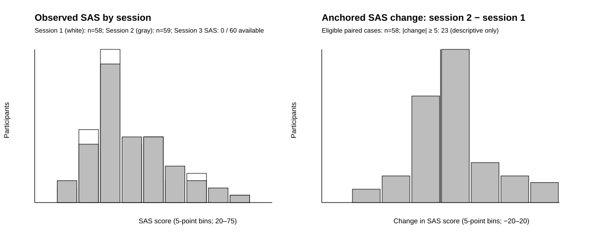

# ds004148 dataset audit

**Audit date:** 2026-09-10
**Scope:** descriptive manifest audit only; no EEG samples were processed and no model was trained.

> **This dataset contains insufficient within-person SAS change to test preservation of symptom change, while providing 58 usable participants for cross-session stability testing.**

The 58-participant conclusion means that all five expected raw EEG tasks are available for sessions 1 and 2 and that both SAS values are present. It supports a cross-session stability benchmark, not a robust claim about preservation of psychiatric symptom transitions: the public table supplies no SAS value for session 3, so there are no complete three-session SAS trajectories or independently observed later transitions.

## Frozen inputs and order

The input is the public `ds004148` participant table plus a frozen public S3 object-listing snapshot for `sub-01` through `sub-60`. The 60 listed participants each have all five expected raw task recordings in all three BIDS-labelled sessions: `eyesclosed`, `eyesopen`, `mathematic`, `memory`, and `music`. Per subject-session, the raw data total 1,500 seconds (25 minutes): five 300-second recordings. The duration calculation is documented by the checked-in representative BrainVision header (61 float32 channels at 500 Hz).

`session1`, `session2`, then `session3` is the chronological order used here. It follows the BIDS session labels; the public metadata does not provide dates, so no timing interval is inferred.

## Primary target: immutable session-1 SAS anchor

For every participant, the only allowed anchor is the session-1 SAS value:

| Quantity | Definition | Availability |
|---|---|---:|
| Anchor | `SAS_session1` | 58 / 60 |
| Session-2 change | `SAS_session2 − SAS_session1` | 58 / 60 paired cases |
| Session-3 change | `SAS_session3 − SAS_session1` | 0 / 60: session-3 SAS absent |

An absent session-1 SAS is never replaced by a later value. An anchored change is blank, never imputed, when its anchor or its session SAS is absent.

## SAS distributions and observed change

| Measure | n | Mean (SD) | Median [Q1, Q3] | Range |
|---|---:|---:|---:|---:|
| Session 1 SAS | 58 | 40.72 (8.42) | 38.5 [35, 45] | 26 to 69 |
| Session 2 SAS | 59 | 41.78 (9.14) | 39 [35, 47] | 25 to 69 |
| Session 3 SAS | 0 | — | — | — |
| Anchored session-2 change | 58 | +1.16 (6.38) | +1 [−2.75, +3] | −15 to +18 |

Six paired cases had zero change. Twenty-three of 58 (39.7%) had an absolute anchored change of at least 5 SAS points. This is a descriptive spread check only—not a clinical threshold, an outcome definition, or evidence of a genuine psychiatric transition.

## Missingness

All 180 subject-session records have the five expected raw EEG task files. Measurement missingness is below; `SAS`, `SDS`, and `ESS` are absent for every session-3 record because the supplied public participant table has no third-visit columns for those measures.

| Session | SAS | SDS | ESS | KSS | PANAS positive | PANAS negative |
|---|---:|---:|---:|---:|---:|---:|
| Session 1 (n=60) | 2 | 2 | 2 | 3 | 3 | 3 |
| Session 2 (n=60) | 1 | 0 | 0 | 2 | 2 | 2 |
| Session 3 (n=60) | 60 | 60 | 60 | 3 | 3 | 3 |
| Total (n=180) | 63 | 62 | 62 | 8 | 8 | 8 |

## Frozen cohort

`analysis_manifest.csv` contains every participant × session record and an `analysis_cohort_included` flag. The frozen primary cohort is exactly the 116 records for the 58 participants marked `true` in sessions 1 and 2; session 3 remains in the manifest but is not in the SAS-change cohort. The corresponding two-session extract is `FROZEN_COHORT_SESSION1_SESSION2.csv`.

Inclusion, exclusions, the session-1-only anchor, and non-imputation rules are frozen in [FROZEN_COHORT_RULES.md](FROZEN_COHORT_RULES.md). Any alteration requires a documented protocol amendment made before modeling, never a response to model performance.

## Interpretation boundary

This dataset is adequate to quantify EEG/SAS stability across a later repeated session for 58 people. It is **insufficient** to meaningfully test whether personalization preserves genuine symptom change, because the available longitudinal SAS data provide one paired follow-up only, no session-3 SAS at all, and no prespecified clinical-transition reference. A future study would need more observed symptom time points and a predeclared meaningful-change criterion.

## Reproducible artifacts

- `analysis_manifest.csv`: full 60 × 3 subject-session table.
- `AUDIT_SUMMARY.json`: machine-readable counts and descriptive statistics.
- `sas-distributions.svg`: the two requested distributions.
- `scripts/audit-ds004148.ts`: manifest generator from frozen source snapshots.
- `scripts/plot-ds004148-audit.py`: dependency-free figure renderer.
- `../sources/datasets/`: public participant/documentation snapshot; source hashes are in `AUDIT_SUMMARY.json`.
